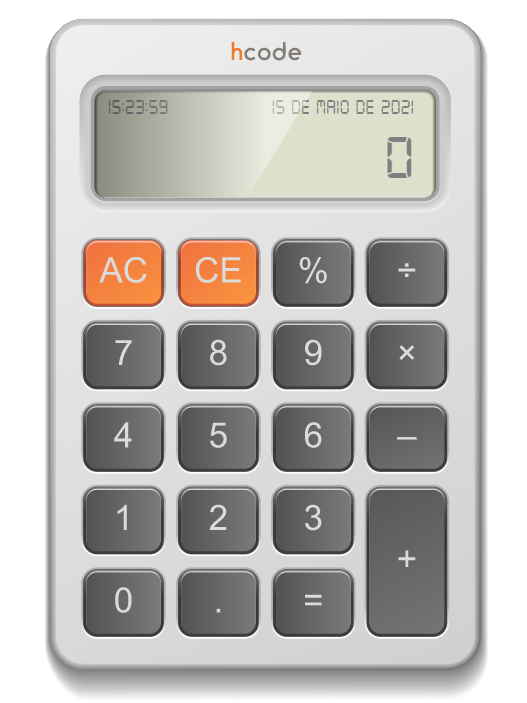

# Calculadora
Uma calculadora construída em um curso de desenvolvimento front-end, a arquitetura do projeto é em MVC para melhor organização e controle, 
boas práticas com Javascript junto a orientação a objetos. Este projeto foi elaborado para desenvolver a lógica da linguagem. 

